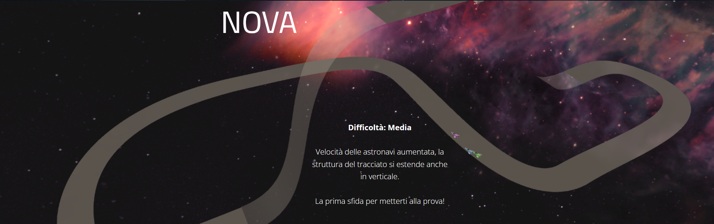

# STAR RACE

Star race is a videogame realized for the course of Computational Geometry of Università degli studi di Milano. \
Star Race is a race game that takes place in space, where the player has to compete with AI controlled enemies to take the first place in the race. 

A website presentation of the game and of the mathematical concept used (in italian) can be found [here](http://www.mat.unimi.it/users/alzati/Geometria_Computazionale_98-99/apps/starrace/home.html). The playable game can be found in the [Applet section](http://www.mat.unimi.it/users/alzati/Geometria_Computazionale_98-99/apps/starrace/applet.html) of the same site. 

# Game Mechanics

## Movement
The player moves using WASD. W allows you to accelerate, A and D are used for lateral movement and S act as a strong break. \
The mouse is used to direct the visual.

## Falling out of track 
Failing to stay on track will result in the spaceship falling off the track. After a brief delay, the veichle will be placed back where he fell. This procedure will make the player lose time and speed. Stay on track to win and don't waste any time. 

## Collisions
Collision between spaceships are enabled. Colliding with an enemy does not cause damage but will result in a strong displacement. If an enemy falls off the track he will waste time while wating to be placed back on track. Use collisions to push enemies off track and gain an advantage.

## Jumps
In the last two tracks is possible to skip certain portions of the tracks by fallig on a lower part of the track. This strategy is admitted if the player needs to recover a strong disadvantage but is not admitted to gain an unfair advantage over the AI. If the player is still at least in second place after using the shortcut, skipping is allowed, but if the player overtakes the enemy in first position he will be penalized. 

# Tracks
Three different tracks are avaiable and each track has a different difficulty setting:

## Saturn
The first track is Saturn. This track is meant to be a tutorial track to learn the basics of the game. The overall speed of each veichle is greatly reduced in order to have better manovrability and the track structure is simple.

## Nova
The second track is Nova. This is the first real race for the player. Spaceships travel at full speed and the track structure is more complex.

## Galaxy
Galaxy is the last track, present sharp turns, a jump and some elements that will make it harder to stay on track. 

# Implementation
The implementation of the AI with an in depth explanation of the movement algorithms and strategies can be found [here](https://github.com/AndreaValota/UnityCarSimulation). \
Since this project was made for a Geometry course, the focus was to apply different geometric concepts to the track. In particular, Bezier Curves were used to create SPLINEs that modeled the track and were also exploited to create the reposition system that is triggered when a spaceship falls off the track. The track surface was created using Bezier Surfaces (3,3) that get approximated using a mesh at runtime. 
